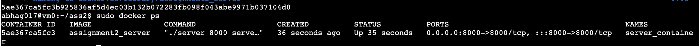
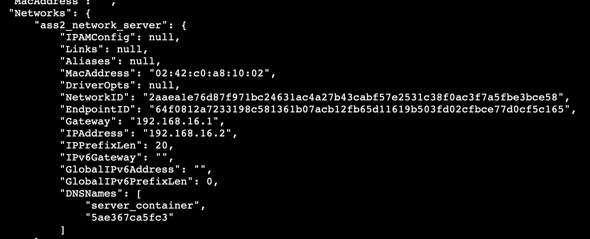
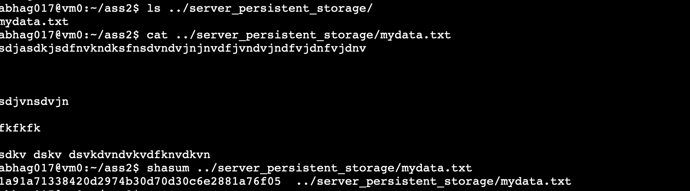
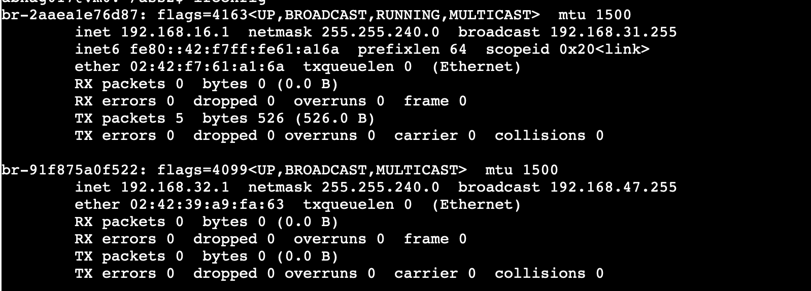
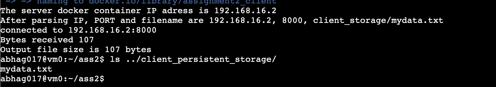
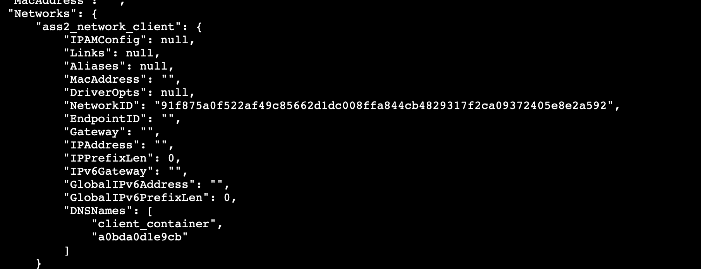
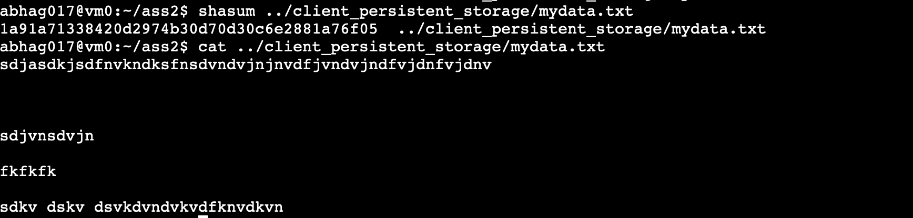

# Instructions

*Assumptions*
- *Linux Machine having docker installed*
- *No previously running docker containers, STOP containers are fine*

## Server Side Instructions
- Make a folder named `ass2` and put your `server.c` code there along with `run_server.sh`.
- Run `./run_server.sh PORT`, where PORT is the argument.
- This will create the docker container having a lightweight gcc image, it will mount the server_persistant_storage in the container and start the server file on port `PORT` by binding the host port `PORT` with the container's port `PORT` and will start serving. Container name is `server_container`.
- You can configure the `path to server_persistent_storage`, `path to server_storage`, `path to main code in docker container` and `filename` in the `Dockerfile`.
- Server is in its own `ass2_network_server` bridge.

## Client Side Instructions
- Make a folder named `ass2` and put your `client.c` code there along with `run_client.sh`
- Run `./run_client.sh PORT`, where PORT is the argument.
- This will create the docker container having a lightweight gcc image. Container name is `client_container`.
- You can configure the `path to client_persistent_storage`, `path to client_storage` ,`path to main code in docker container` and `filename` in the `client_dockerfile`.
- Client is in its own `ass2_network_client` bridge.
- Client bash file automatically finds the IP of the `server_container`.
- Client Container will run the `client.c`, transfer the file to `client_persistent_storage` through the mount point `client_storage` and terminate hence stopping the container.

## How to Set up Iptables
- Get the id of these 2 bridges using ifconfig. Then write the commands:
  - `sudo iptables -I DOCKER-USER -i <br1> -o <br2> -j ACCEPT`
  - `sudo iptables -I DOCKER-USER -i <br2> -o <br1> -j ACCEPT`
- This enables bidirectional communication in these 2 subnets

## STEPS
- Run `run_server.sh`.
  - Both network bridges will be formed.
- Set up IP Tables.
- Run `run_client.sh`.
- Output file will be in the `client_persistent_storage` folder.

## Demonstration
- Starting Point
  - 
- Running `run_server.sh`on port 8000
  - 
  - Showing now its network group and gateway, both networks are formed.
  - 
  - Showing the datafile and its shasum now in the persistent storage mounted to the server.
  - 
  - Id of those 2 bridges.
  - 
- Modifying IPTables
  - 
- Running `run_client.sh` and giving port 8000
  - Server id automatically determined, file transferred and ended
  - 
  - We clearly see a different network bridge for the client container, the IP is not given right now is because the container ended after running the client file. Since its a differnt network group we clearly see inter bridge communication due to our modified IPTables.
  - 
  - The data file in the client persistence storage now along with output and shasum
  - 
