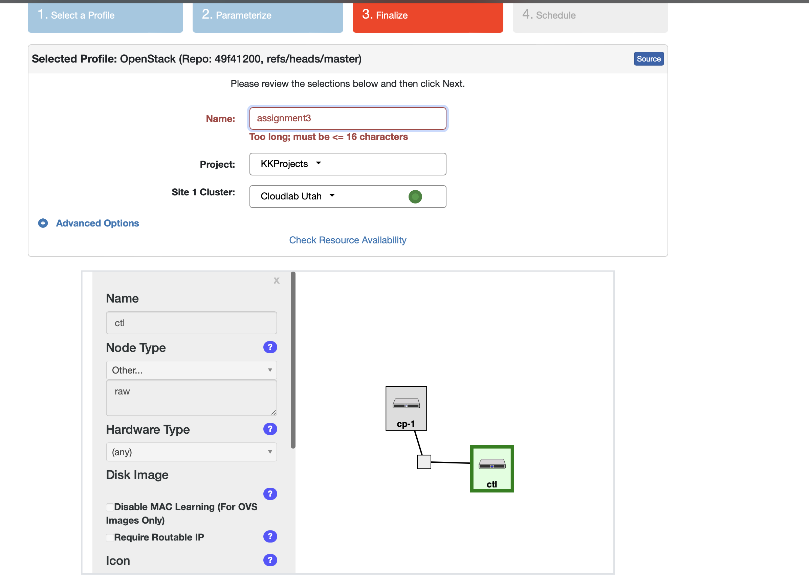
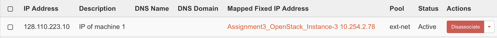
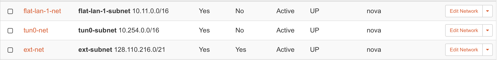
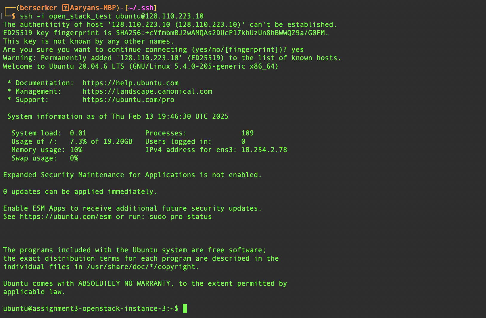
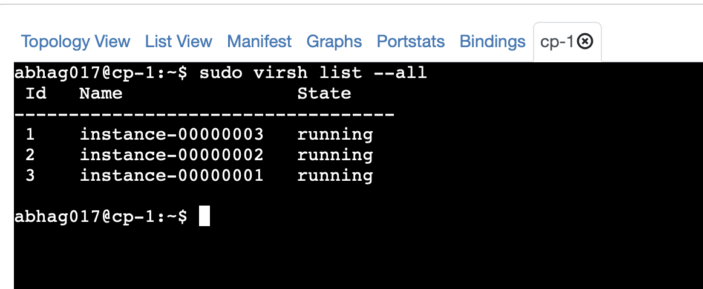
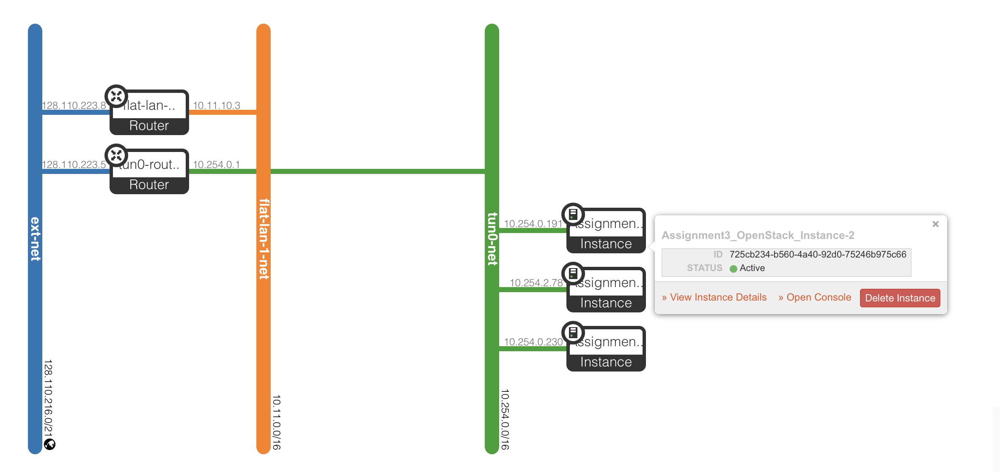
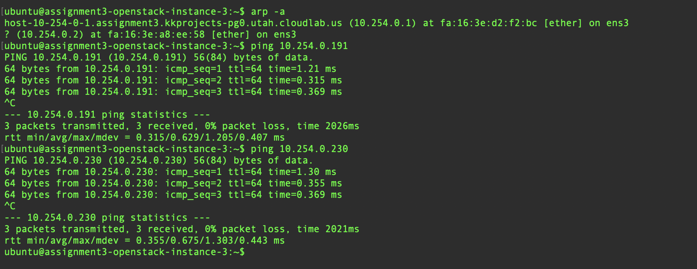
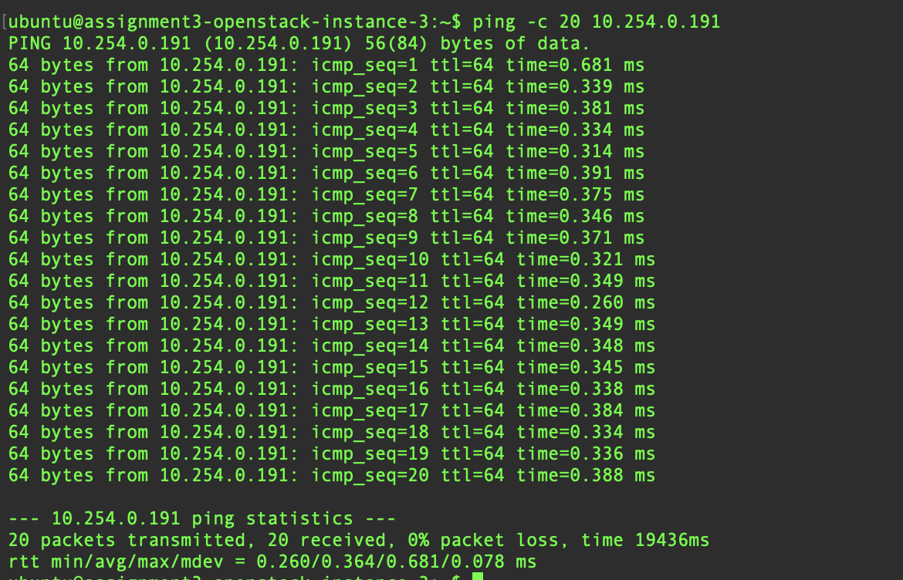
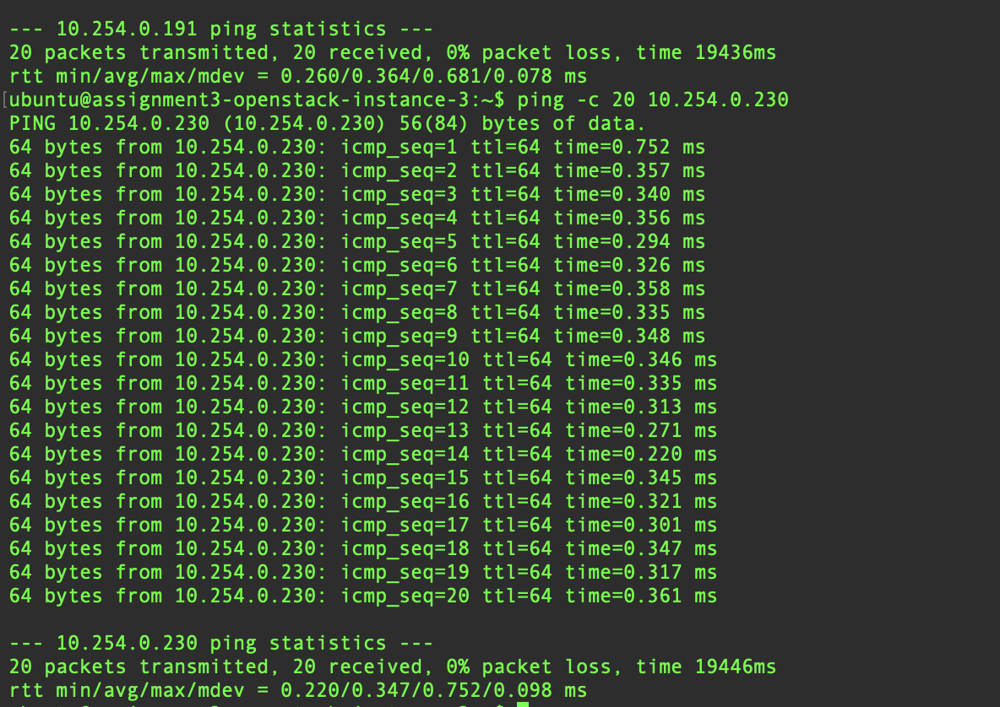

# Initialization Steps
- Logged into Cloudlab.
- Started an experiment with profile name `OpenStack`.
- Default parameters.
  - 
  - 16 hours experiment
- Gave Floating IP.
  - 
  - As one can see the external IP of the 3 machines is a whole subnet of its own.
  - 
- Have created the SSH keypair file.

# Logging in using SSH
- Using the SSH private key stored in my personal machine, I logged in.
  - 

# Topology
- Running Instances as shown from the node which hosts all VMs.
  - 
- Current network topology
  - 
  - After logging in I can ping the other 2 as well.
    - 
- To calculate average rtt I used 20 ping packets for using machine A to both B and C.
  - Results
  - Machine A
    - 
  - Machine B
    - 

# Virtual Nodes and Physical Nodes
- Virtual Nodes are different VMs on the same physical machine.
- Physical Node are the actual machines.

# DNAT different from SNAT
- DNAT alters IP packets and changes destination such that it reaches a private IP inside the network.
- SNAT alters outgoing IP so that an internal node inside a network needs to communicate with an external node.