# Reading Question 1

## Ephemeral Disk
Its a non persistent storage attached to an instance for during its lifecycle. They are created on compute node's local storage.

## Difference between shared storage live migration block live migration and volume live migration
- Shared storage live migration relies on  shared storage system to store the VM's disk image. During migration only the memory and CPU State of the VM are moved to destination.
- Block Live Migration both the memory and disk image are migrated from source VM to destination VM. It can be slower and downtime is longer.
- Volume Backed Live Migration, the VM's disk is actually an extra storage (cinder volume) instead of an ephemeral storage. The instance iteslf is moved to desination storage, migration means to transfer the instance's memory and configuration but aside from the actual volume. This does not need shared local storage and less bandwidth.

## Block Live Migration time lag
Block live migration involves transferring the entire VM's disk in addition to memory and CPU state. Hence its severely dependent upon network bandwidth, disk read and write speed, storage type etc.

## KVM-libvirt general and advanced configurations
- `live_migration_downtime` defines the maximum amount of time allowed for downtime during live migration. The VM is in freeze state. The lower this downtime, the quicker the migration process.
- `live_migration_downtime_steps`: defines the number of steps to perform during the migration to reduce downtime. Increasing the number of steps can help reduce downtime but may increase the overall complexity of the migration.
- `live_migration_downtime_delay`: introduces a delay between each downtime step, hence controlling the timing of the downtime reduction steps.

## Default parameters

Post-Copy is not the default setting for live migration in KVM/libvirt. Pre-copy is generally the default.

# Reading 2

## Fill in the blanks

Storage XenMotion

## Check logs when migration failed.

From the article "If the instance is still running on HostB, the migration failed. The nova-scheduler and nova-conductor log files on the controller and the nova-compute log file on the source compute host can help pin-point the problem."

## Definition of auto-convergence

From the article "Auto-convergence is a Libvirt feature. Libvirt detects that the migration is unlikely to complete and slows down its CPU until the memory copy process is faster than the instance's memory writes."

# Parameters of the experiment launched
- Launch Parameters
  - 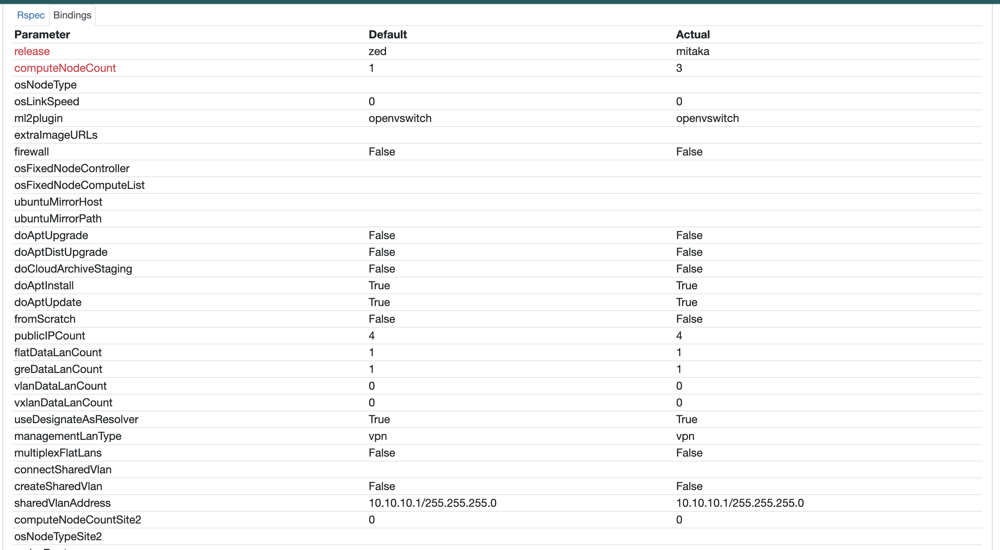
- Accidentlly created 3 nodes hence later deleted one node.
  - 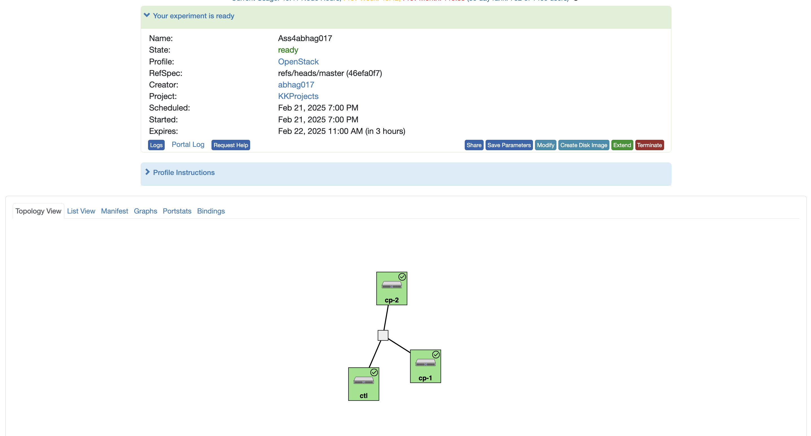
- Created 2 instances in openstack
  - 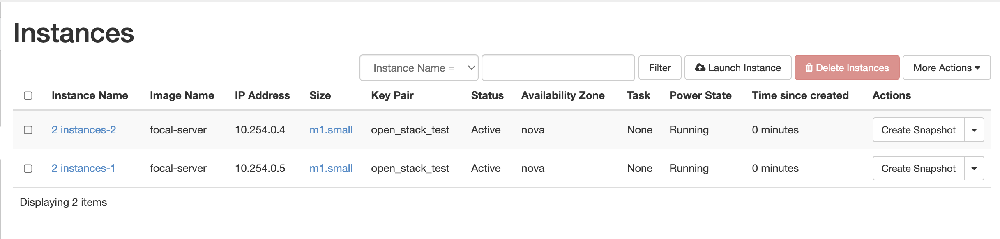

# Hostnames
- 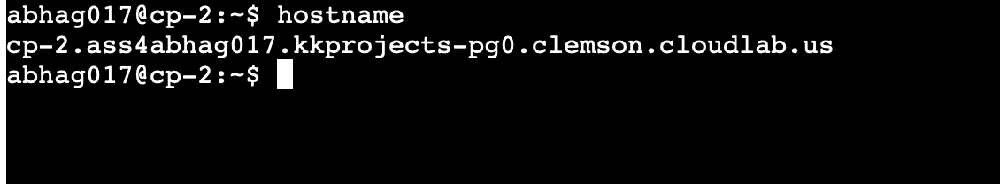
- 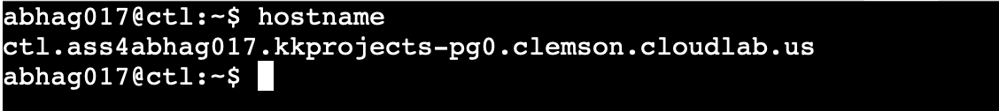
- 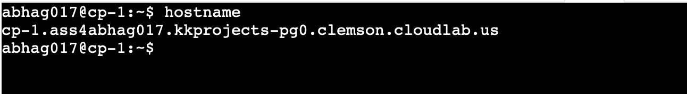

# Passwordless Access
- 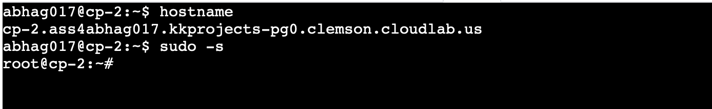
- 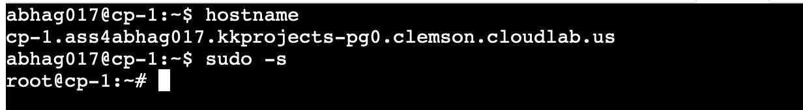

# NFS server at CP-1
- 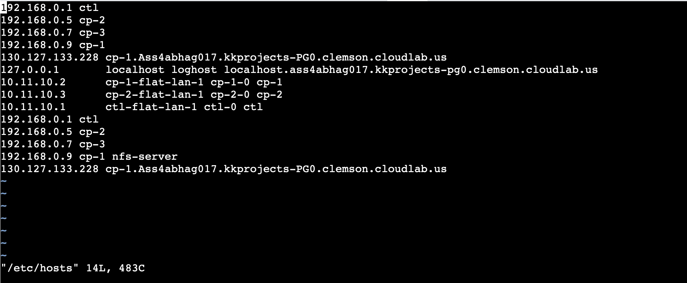

# More commands
- 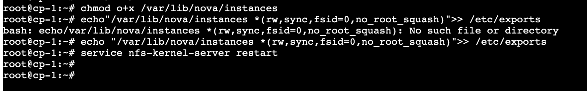
- 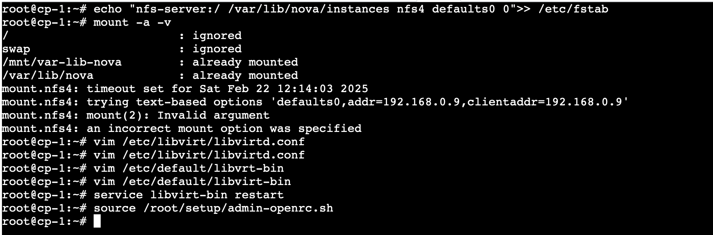
- Openstack commands
  - Server list
  - 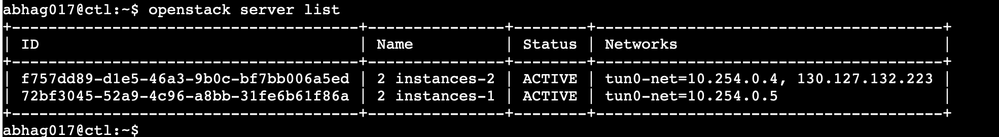
  - Seeing that the first instance is hosted on cp1
  - 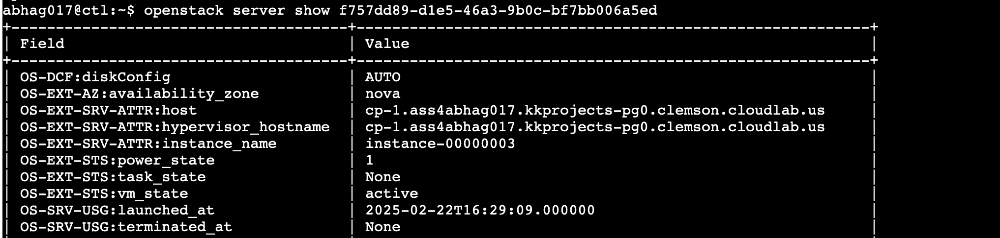

# Show HyperVisor Information
- Doing hypervisor list shows us as 3 hypervisors in 3 compute nodes. But checking information on the 3rd one gives us an error, I think this bug is caused because I created 3 nodes and deleted one. Nonetheless it should not affect the communcation between the other 2 nodes.
  - 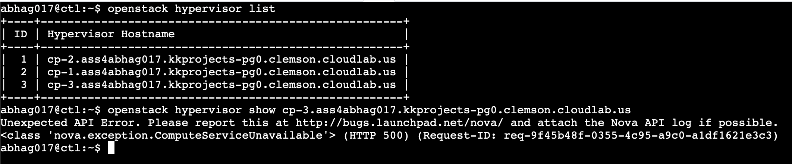
- Showing information for hypervisor at cp 2
  - 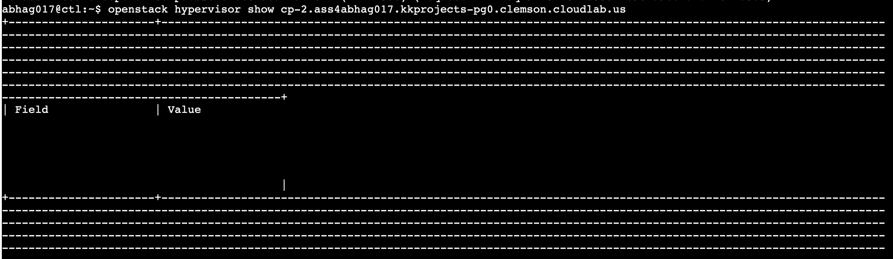
  - 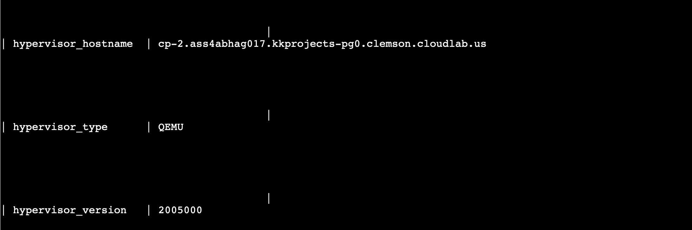
- Showing information for hypervisor at cp 1
  - 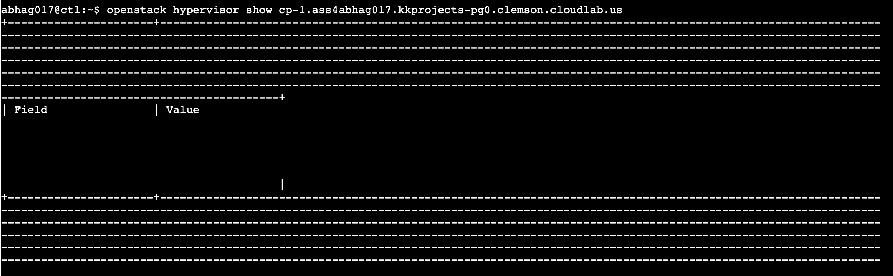
  - 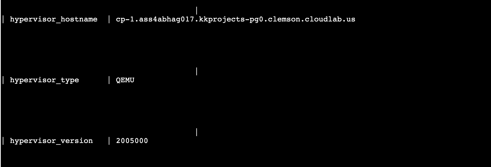

# Showing Compute Nodes
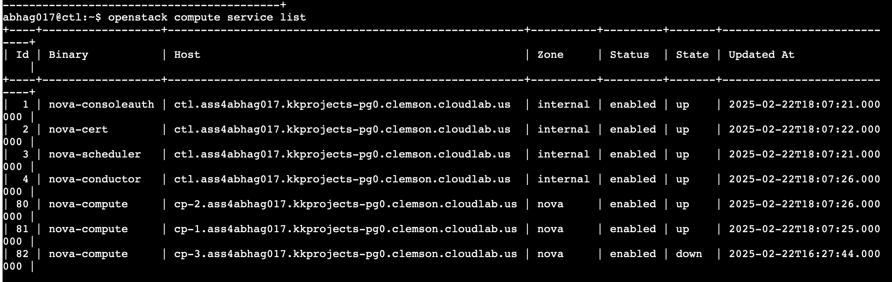

# Live migration
- First fixing error in my compute nodes regarding mounting, now I have succesfully mounted.
  - Fixing this error required me to create new open stack instances, rest everything is same, so my new ids of openstack vms is
  - 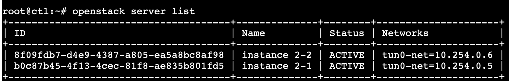
  - Performing live migration to cp2
    - 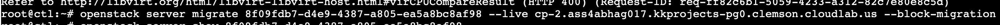
  - Now both vms are on compute node 2
    - 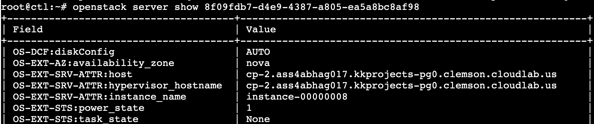
    - 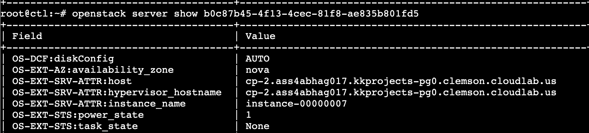
    - Hence succesful live migration.