# Kubernetes Installation Setup

## Setting up pre-requisites in nodes

- Machine 1
  - `sysctl.conf` file:
  - 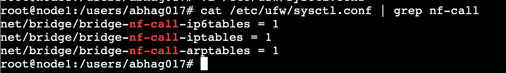
  - `/etc/fstab` file:
  - 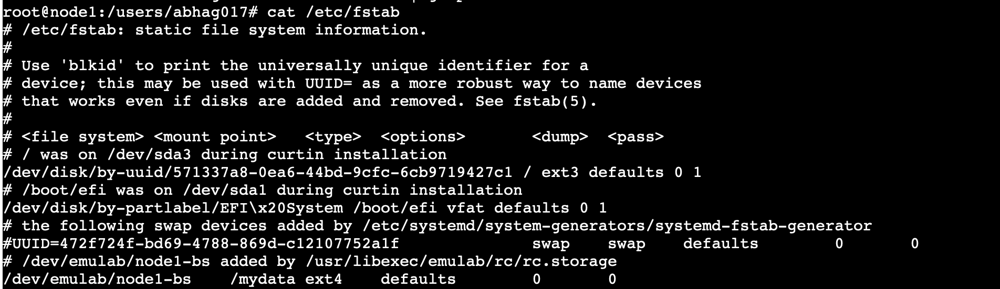
- Machine 0
  - `systcl.conf` file:
  - 
  - `/etc/fstab` file:
  - 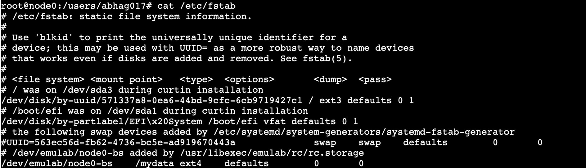

## Setting up kubectl kubelet kubeadm
- Machine 0
  - 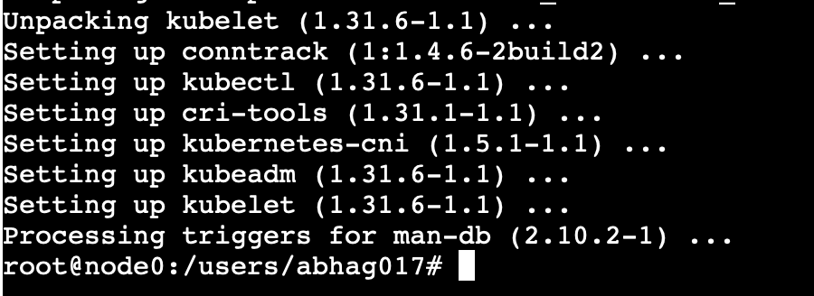
- Machine 1
  - 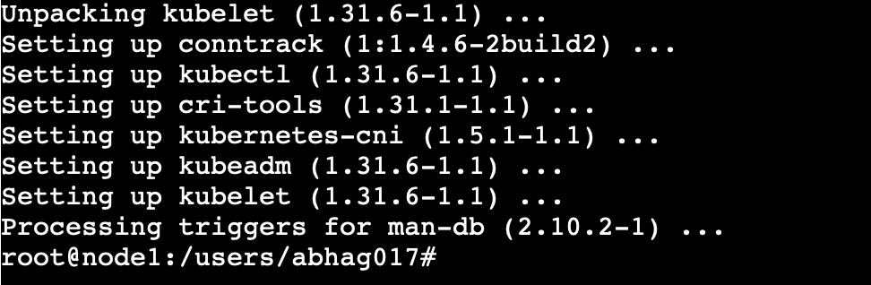

## Cluster Setup
- Master node 1
  - 
- Worker node joined
  - 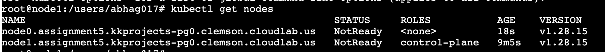
- After calico
  - 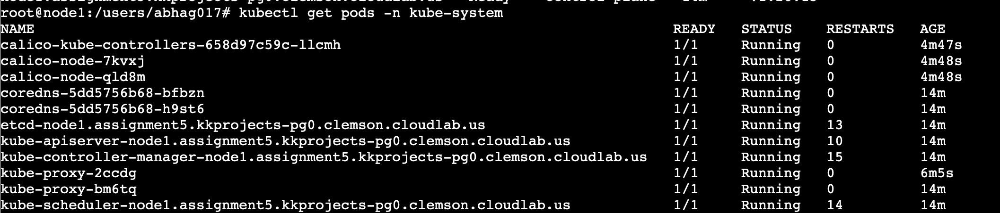
- Ready
  - 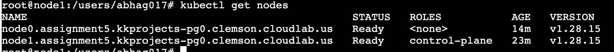

## Nginx
- Configuration
  - 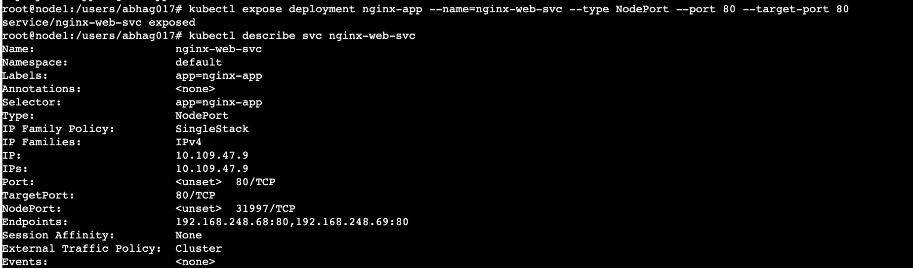

### Deployment

```
apiVersion: apps/v1
kind: Deployment
metadata:
  annotations:
    deployment.kubernetes.io/revision: "1"
  creationTimestamp: "2025-03-03T08:13:50Z"
  generation: 1
  labels:
    app: nginx-app
  name: nginx-app
  namespace: default
  resourceVersion: "2747"
  uid: 1946350b-eb5d-424d-9088-65695329cae4
spec:
  progressDeadlineSeconds: 600
  replicas: 2
  revisionHistoryLimit: 10
  selector:
    matchLabels:
      app: nginx-app
  strategy:
    rollingUpdate:
      maxSurge: 25%
      maxUnavailable: 25%
    type: RollingUpdate
  template:
    metadata:
      creationTimestamp: null
      labels:
        app: nginx-app
    spec:
      containers:
      - image: nginx
        imagePullPolicy: Always
        name: nginx
        resources: {}
        terminationMessagePath: /dev/termination-log
        terminationMessagePolicy: File
      dnsPolicy: ClusterFirst
      restartPolicy: Always
      schedulerName: default-scheduler
      securityContext: {}
      terminationGracePeriodSeconds: 30
status:
  availableReplicas: 2
  conditions:
  - lastTransitionTime: "2025-03-03T08:14:03Z"
    lastUpdateTime: "2025-03-03T08:14:03Z"
    message: Deployment has minimum availability.
    reason: MinimumReplicasAvailable
    status: "True"
    type: Available
  - lastTransitionTime: "2025-03-03T08:13:50Z"
    lastUpdateTime: "2025-03-03T08:14:03Z"
    message: ReplicaSet "nginx-app-5777b5f95" has successfully progressed.
    reason: NewReplicaSetAvailable
    status: "True"
    type: Progressing
  observedGeneration: 1
  readyReplicas: 2
  replicas: 2
  updatedReplicas: 2
```

### Service
- Service deployed
  - 
- Virtual IPs
  - 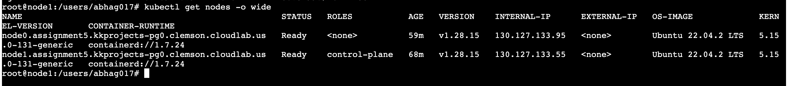


```
apiVersion: v1
kind: Service
metadata:
  name: nginx-web-svc
spec:
  selector:
    app: nginx-app  # Same name as deployment
  ports:
    - protocol: TCP
      port: 80         # Port that the service exposes
      targetPort: 80    # Port on the container where the service sends traffic
  type: NodePort       # Exposes the port of all pods
```
- Accessing node 1 with vip
  - 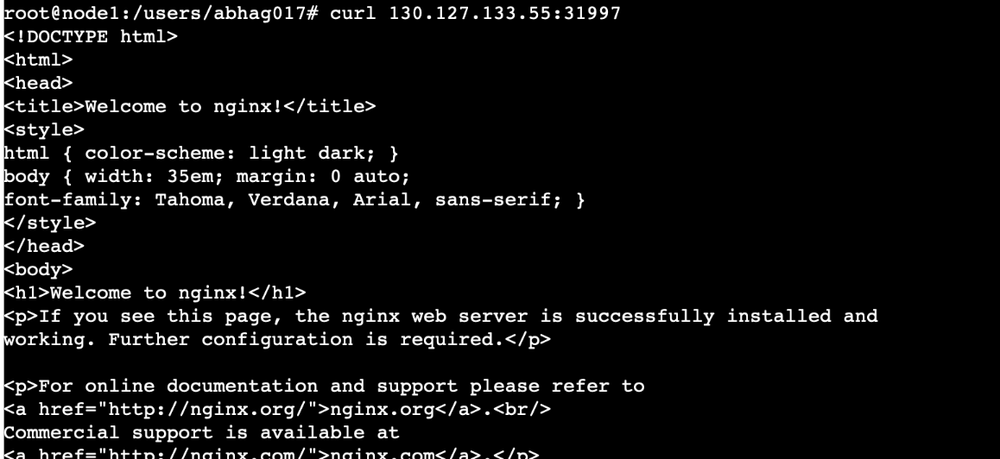
- Accessing node 2 with vip
  - 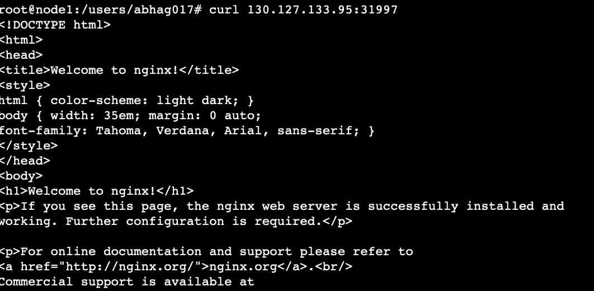